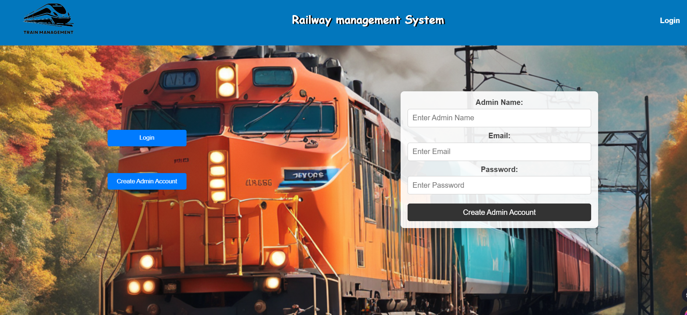

## Project Overview 📋
The **Railway Management System** is a web application designed to help users and administrators manage train bookings, view train details, and much more. The system supports two key roles:
- **Admin**: Can add, edit, and remove train details.
- **User**: Can search for trains between a source and destination and book tickets.

---

## Features 🌟
1. **User Authentication** 🔒:
   - Users can sign up and log in to the system.
   - Admin can sign up and log in using admin credentials.

2. **Train Search & Booking** 🔍:
   - Users can search for trains by entering source and destination.
   - If available, users can book train tickets.

3. **Ticket Generation** 🎫:
   - After booking, the system generates a ticket on a new page displaying the ticket details.

4. **Admin Dashboard** 🛠️:
   - Admin can add new trains, remove existing trains, and update train details.

5. **Database Integration** 🗃️:
   - The application is connected to a database (e.g., MySQL) for storing user information, train details, and ticket bookings.

---

## 📷 Screenshots

Here’s what RailwayManagementSystem looks like in action:





## Tech Stack 💻
- **Frontend**: HTML, CSS, JavaScript, React
- **Backend**: Node.js, Express.js
- **Database**: MySQL (or any other relational database)
- **Authentication**: JWT (JSON Web Tokens) for secure login and sign-up

---

## Installation & Setup 🛠️

To get started with the Railway Management System project locally, follow these steps:

### 1. **Clone the Repository** 📥
First, clone this project to your local machine using the following command:
```bash
git clone https://github.com/your-username/railway-management-system.git
```

### 2. **Navigate to Project Directory** 🗂️
Once cloned, navigate into the project directory:
```bash
cd railway-management-system
```

### 3. **Frontend Setup (React)** 🚀
Navigate to the `client` directory and install dependencies:
```bash
cd client
npm install
```
Start the React application:
```bash
npm start
```
The frontend will run at `http://localhost:3000`.

### 4. **Backend Setup (Node.js)** 🔧
Navigate to the `server` directory:
```bash
cd server
npm install
```
Run the backend using `nodemon`:
```bash
nodemon index.js
```
The backend will run at `http://localhost:5000` (or any other port you have configured).

### 5. **Database Configuration** 🗄️
Set up your MySQL (or any other relational database) locally. Make sure your database is running, and modify the database connection details in the backend (`server/config/db.js`) to match your local database credentials.

---

## Usage 📝

### **User Login & Booking**:
- Sign up and log in as a user.
- After logging in, you can search for trains by entering the source and destination.
- If trains are available, you can book tickets.

### **Admin Login & Train Management**:
- Admin can log in with admin credentials.
- Admin can add new trains, remove existing trains, or update train details.

---

## Acknowledgments 🙏
- **React** for building the frontend.
- **Node.js** and **Express.js** for the backend development.
- **MySQL** for database management.
- **JWT** for secure authentication.

---

## Contact 📬
- **Your Name**: Pratik Sindhiya
- **Email**: [pratiksindhiya@gmail.com](mailto:pratiksindhiya@gmail.com)
- **GitHub Profile**: [github.com/PRATIKSINDHIYA](https://github.com/PRATIKSINDHIYA)
- **LinkedIn**: [linkedin.com/in/pratiksindhiya](https://www.linkedin.com/in/pratiksindhiya/)

---

